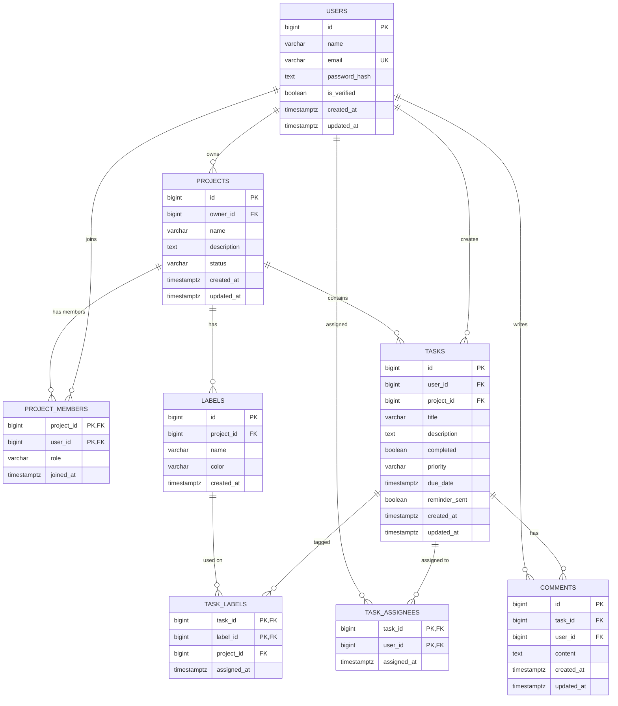

# ER Diagram (Mermaid)

Rendered automatically by GitHub / most Markdown viewers.

```mermaid
erDiagram
    USERS {
        bigint id PK
        varchar name
        varchar email UK
        text password_hash
        boolean is_verified
        timestamptz created_at
        timestamptz updated_at
    }
    PROJECTS {
        bigint id PK
        bigint owner_id FK
        varchar name
        text description
        varchar status
        timestamptz created_at
        timestamptz updated_at
    }
    PROJECT_MEMBERS {
        bigint project_id PK,FK
        bigint user_id PK,FK
        varchar role
        timestamptz joined_at
    }
    TASKS {
        bigint id PK
        bigint user_id FK
        bigint project_id FK
        varchar title
        text description
        boolean completed
        varchar priority
        timestamptz due_date
        boolean reminder_sent
        timestamptz created_at
        timestamptz updated_at
    }
    TASK_ASSIGNEES {
        bigint task_id PK,FK
        bigint user_id PK,FK
        timestamptz assigned_at
    }
    COMMENTS {
        bigint id PK
        bigint task_id FK
        bigint user_id FK
        text content
        timestamptz created_at
        timestamptz updated_at
    }
    LABELS {
        bigint id PK
        bigint project_id FK
        varchar name
        varchar color
        timestamptz created_at
    }
    TASK_LABELS {
        bigint task_id PK,FK
        bigint label_id PK,FK
        bigint project_id FK
        timestamptz assigned_at
    }

    USERS ||--o{ PROJECTS : "owns"
    USERS ||--o{ PROJECT_MEMBERS : "joins"
    PROJECTS ||--o{ PROJECT_MEMBERS : "has members"
    USERS ||--o{ TASKS : "creates"
    PROJECTS ||--o{ TASKS : "contains"
    TASKS ||--o{ TASK_ASSIGNEES : "assigned to"
    USERS ||--o{ TASK_ASSIGNEES : "assigned"
    TASKS ||--o{ COMMENTS : "has"
    USERS ||--o{ COMMENTS : "writes"
    PROJECTS ||--o{ LABELS : "has"
    TASKS ||--o{ TASK_LABELS : "tagged"
    LABELS ||--o{ TASK_LABELS : "used on"
```
